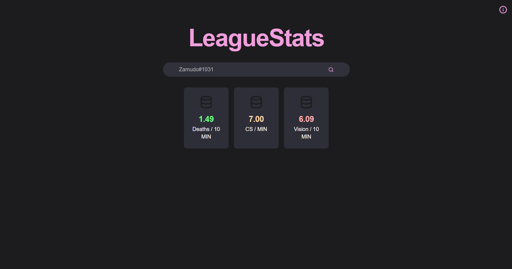
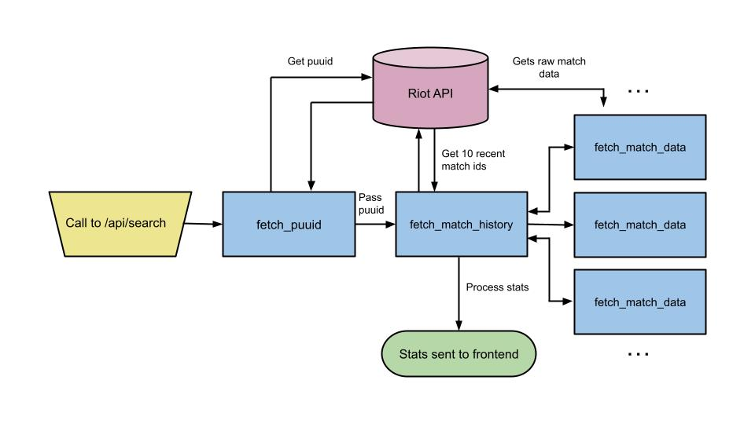

# LeagueStats
LeagueStats is a web application that helps players analyze their League of Legends performance by retrieving raw match data from the **Riot REST API** and processing it to generate key statistics, such as CS per minute, deaths per 10 minutes, and vision score per 10 minutes.

**Tech used:**
- **Frontend:** React, JavaScript, HTML, CSS
- **Backend:** Flask (Python), Riot API, aiohttp (for async requests)

LeagueStats was built using **React** on the frontend and **Flask** on the backend.

## Optimizations
The biggest improvement was reducing API request time. Initially, match data was fetched sequentially, leading to unnecessary delays when retrieving multiple games. To solve this, I implemented **aiohttp** to allow multiple API requests to be processed in **parallel**.

✅ **Parallelized Riot API requests** → Fetch match history and all match data simultaneously. 

## Lessons Learned:

- **Async Python is powerful** → Using `asyncio` and `aiohttp` made API calls much faster compared to sequential requests.
- **Data Flow Optimization** → Looking back, I realize that the current data flow could be streamlined. If I were to redo the project, I would focus on reducing redundant returns to backend functions to have a streamlined flow from the api call to the data being sent to the frontend.
- **State Management for Data Pipeline** → lifting state and backend calls up to App.jsx improved data flow and made it easier to pass data between components.

## How to Run

I wouldn't recommend trying to run it because a API key is hard to get. I am not deploying because it only lasts 24 hours.

- Generate a 24hr Riot API key and add it in a `.env` in the backend folder (`RIOT_API_KEY=''`)
- Install dependencies `pip install -r requirements.txt`
- navigate to the frontend and run `npm start`
- navigate to the backend and run `App.py`